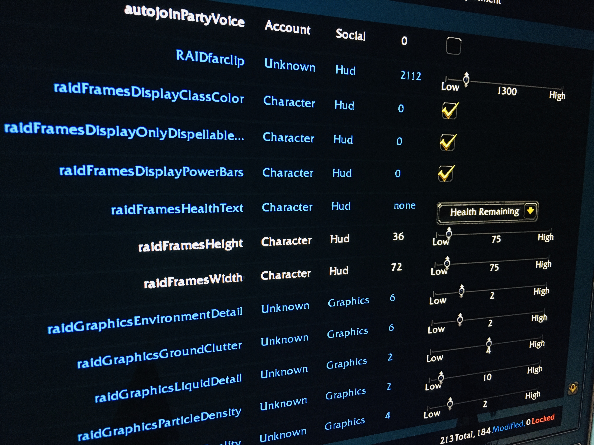

# jVars
## Warcraft CVars mod, since 2019

## License

## Why
- Because CVar value standardization did not previously exist
- ...I don't want to look up these settings every time 

## How
Interface > Addons UI

## Platforms
UI works with Classic Era, Classic Wrath and Retail

## FAQ
- I added a lot of CVars but not all
- ...you may request additions

## Issues
https://github.com/jadissa/jVars/issues

## Screenshots

   

